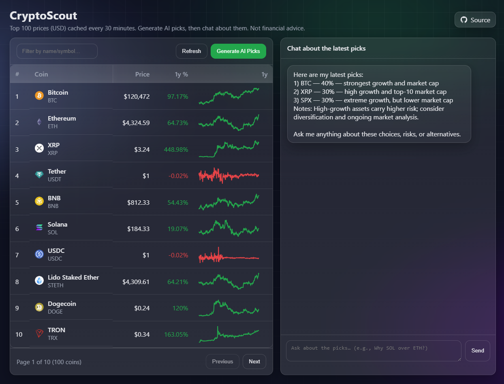

# CryptoScout

[Live Demo ->](https://zonal-sallyanne-rayanbhatti2002-9d154d18.koyeb.app/)

ASP.NET Core 8 website that lists the **top 100 crypto assets** and (optionally) asks an LLM for a **buy shortlist** based on **1-year growth**.  
Stack: **.NET 8 + Razor Pages**, **CoinGecko Demo API** (market data), **Groq** (OpenAI-compatible) for recommendations & chat.

> Not financial advice. For educational use only.



---

## Highlights

- **Free data source:** CoinGecko Demo API (`coins/markets`)
- **LLM provider:** Groq (`llama-3.1-8b-instant`) via OpenAI-compatible endpoint
- **Manual AI trigger:** picks are generated **only** when you click **“Generate AI Shortlist”** (green button)
- **Conversational UX:** picks are posted **in the chat** and you can ask follow-ups about the shortlist
- **30-minute tick:** server caches market data for 30 minutes (no websockets)
- **Pagination:** table shows **10 coins per page** with Previous/Next
- **1-year sparklines:** inline SVG sparkline per visible coin (lazy-loaded)
- **Clean endpoints:** `/api/coins`, `/api/recommend?take=3`, `/api/sparkline?id=bitcoin&days=365`, `/api/chat`, `/health`
- **Polished UI:** responsive, mobile-friendly, glassy cards, sticky table headers, animated background, top-right **Source** link

---

## Project structure

```
CryptoScout/
├─ CryptoScout.csproj
├─ Program.cs
├─ .env.local              # not committed; holds your API keys
├─ Models/
│  └─ CryptoAsset.cs
├─ Services/
│  ├─ ICryptoDataProvider.cs
│  ├─ CoinGeckoProvider.cs
│  └─ OpenAIRecommender.cs
├─ Pages/
│  ├─ Index.cshtml         # table + chat UI, sparklines, styles
│  └─ Index.cshtml.cs
└─ wwwroot/
   └─ (static assets)
```

---

## Prerequisites

- .NET 8 SDK
- A **Groq API key** (free tier available)
- A **CoinGecko Demo API key** (free)

---

## Configuration

Create **`.env.local`** in the project root:

```ini
GROQ_API_KEY=your_groq_key_here
COINGECKO_API_KEY=your_coingecko_demo_key_here
```

Loaded at startup via `DotNetEnv`. Do **not** commit this file.

---

## Install and run

From the project root:

```bash
dotnet restore
dotnet run --urls http://localhost:5000
```

Open `http://localhost:5000`

### Convenience (Windows)

```powershell
.
un.bat
```

Runs: load `.env.local` → `dotnet clean` → `dotnet build` → `dotnet run`.

---

## How it works

### Data (CoinGecko)

- `Services/CoinGeckoProvider.cs`
  - Top 100:  
    `GET /api/v3/coins/markets?vs_currency=usd&per_page=100&order=market_cap_desc&price_change_percentage=1y`
  - Sparkline (per coin):  
    `GET /api/v3/coins/{id}/market_chart?vs_currency=usd&days=365&interval=daily`
  - Sends `x-cg-demo-api-key: <COINGECKO_API_KEY>` if provided.
  - Caches results for **30 minutes** (`IMemoryCache`).

### AI (Groq)

- `Program.cs`: configures `OpenAI.Chat.ChatClient` with:
  - `Endpoint = https://api.groq.com/openai/v1`
  - `Model = llama-3.1-8b-instant`
- `Services/OpenAIRecommender.cs`:
  - Asks the model for a JSON-only shortlist (symbols, weights, reasoning) using the latest 1-year data.
  - If parsing fails or result is empty, falls back to a simple heuristic (top growth with even weights).
- **/api/recommend** stores the latest shortlist in cache so **/api/chat** can discuss those exact picks.

### UI (Razor page)

- `Pages/Index.cshtml`:
  - **Left:** Prices table (filter, paging, 1-year % column, inline sparklines for the 10 visible coins).
  - **Right:** Chat panel (assistant & user bubbles, keyboard submit).
  - **Green “Generate AI Shortlist” button** triggers `/api/recommend` and posts the picks **directly into chat**.
  - Responsive layout, animated background, glassy cards, sticky table headers.
  - Top-right **Source** link: https://github.com/RayanBhatti/CryptoScout

---

## API endpoints

- `GET /api/coins` → `CryptoAsset[]`  
  Example item:
  ```json
  {
    "id": "bitcoin",
    "symbol": "btc",
    "name": "Bitcoin",
    "image": "https://...",
    "currentPrice": 67345.12,
    "marketCapRank": 1,
    "priceChangePercentage1yInCurrency": 120.3,
    "priceChangePercentage1y": 120.3
  }
  ```

- `GET /api/sparkline?id=bitcoin&days=365` → `number[]` (daily prices for inline sparkline)

- `GET /api/recommend?take=3` → shortlist
  ```json
  {
    "top": [
      { "symbol": "btc", "weight": 0.34, "why": "…" },
      { "symbol": "eth", "weight": 0.33, "why": "…" },
      { "symbol": "sol", "weight": 0.33, "why": "…" }
    ],
    "notes": "Risk note…"
  }
  ```

- `POST /api/chat` → chat with the latest shortlist (request/response messages array)

- `GET /health` → `{ "ok": true }`

---

## Customization

- **Page size**: `Pages/Index.cshtml` → `const pageSize = 10;`
- **Tick interval**: `CoinGeckoProvider` cache expiry → `TimeSpan.FromMinutes(30)`
- **Model**: `Program.cs` → `const string groqModel = "llama-3.1-8b-instant";`
- **Shortlist size**: Frontend calls `/api/recommend?take=3` (adjust query or enforce in `Program.cs`)
- **UI theme**: All styles are inline in `Index.cshtml` (tokens at the top). Button class for the shortlist is `btn btn-green`.

---

## Troubleshooting

- **“No picks returned.”**  
  The recommender falls back automatically; if still empty, check server logs (401/429). Verify `GROQ_API_KEY`.

- **CoinGecko 401/403**  
  Ensure `COINGECKO_API_KEY` is set and rate limits aren’t exceeded.

- **`.env.local` not loading**  
  Confirm `Program.cs` contains:
  ```csharp
  if (File.Exists(".env.local")) { Env.Load(".env.local"); }
  ```

- **Port conflicts**  
  Run with another port: `dotnet run --urls http://localhost:5050`

---

## Security

- Never commit secrets. `.env.local` is git-ignored.
- For production, use your platform’s secret manager (environment variables).

---

## License

Choose your preferred license (e.g., MIT or Apache-2.0).

---

## Disclaimer

Crypto markets are volatile. This project is for demonstration and education only. It does not provide financial advice.
